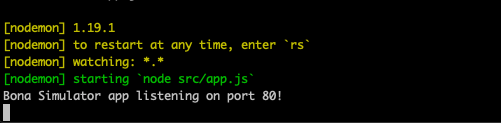
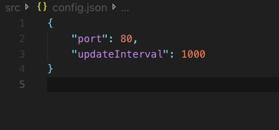
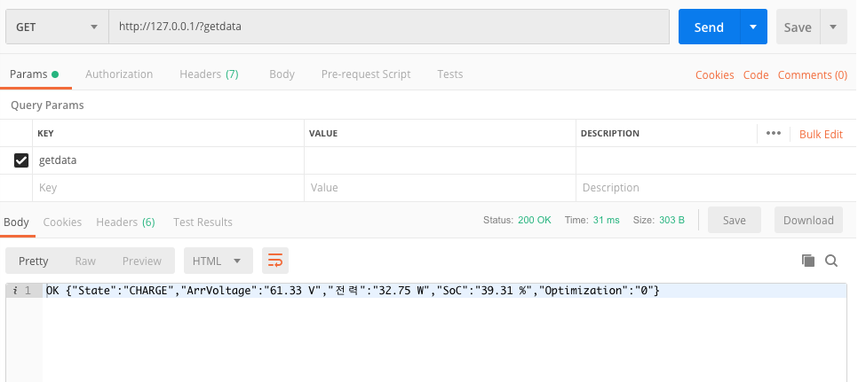
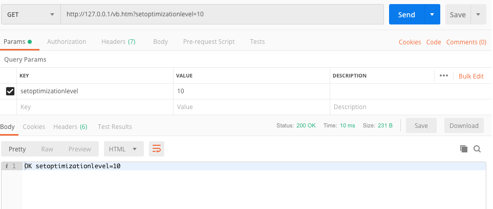

<h1 >Welcome to Elsys-R200 Bona Simulator 👋</h1>
<p>
  
</p>

## 사용 가이드 
- [Node.js](https://nodejs.org/ko/) 설치 
- 소스코드 다운로드
- 소스코드 폴더에서 npm install 
- npm start




## 설정 변경 방법 

- src/config.json 파일 변경



## Requirement
- [Node.js](https://nodejs.org/ko/) 

## Init

```sh
npm install
```

## Usage
```sh
npm start
```




## Author

👤 **cckn**

* Github: [@cckn](https://github.com/cckn)

## Show your support

Give a ⭐️ if this project helped you!

***
_This README was generated with ❤️ by [readme-md-generator](https://github.com/kefranabg/readme-md-generator)_